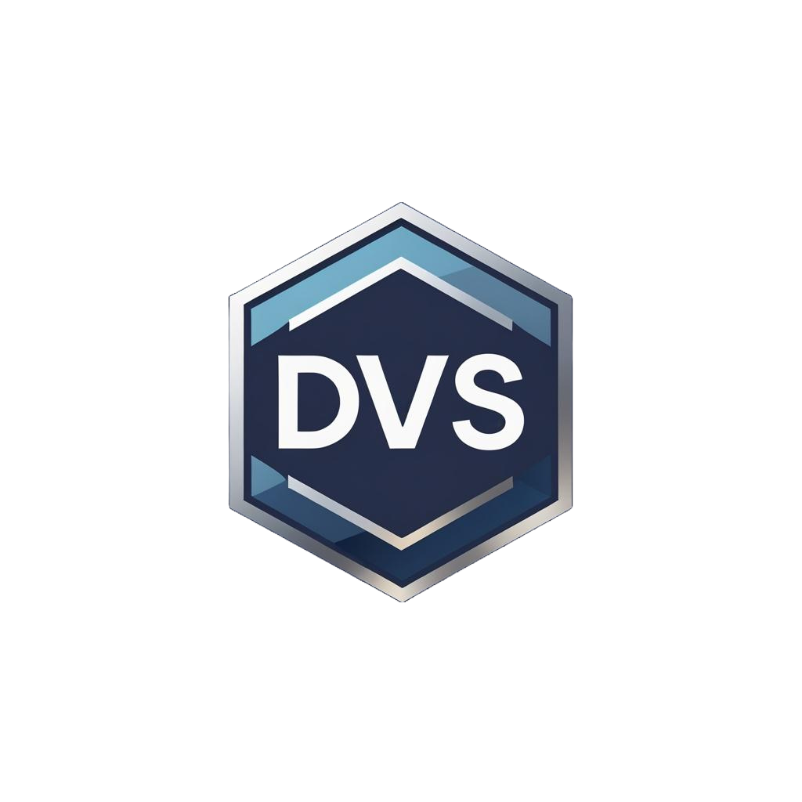

# 🚀 Duba Venkata Satyanarayana - Portfolio

<div align="center">



**Full Stack Developer | Java & Cloud Specialist**

[](https://satyaportfolio-ten.vercel.app/)
[](https://www.linkedin.com/in/duba-venkata-satyanarayana-3bb8a1259/)
[](https://github.com/Satya136-dvsn)

</div>

---

## 🌐 Live Demo

**Visit:** [https://satyaportfolio-ten.vercel.app/](https://satyaportfolio-ten.vercel.app/)

---

## ✨ Features

| Feature | Description |
|---------|-------------|
| 🌙 **Modern Dark Theme** | Sleek gradient design with animated starfield background |
| 📱 **Fully Responsive** | Optimized for desktop, tablet, and mobile devices |
| 🏷️ **Project Filters** | Filter by Full Stack, Data Analytics, Web Dev, Embedded Systems |
| 🎬 **Intro Animation** | Animated welcome screen on first visit |
| 📄 **Resume Download** | One-click resume download |
| 📧 **Contact Form** | Functional email contact via EmailJS |
| 🔗 **GitHub Integration** | Direct links to all project repositories |

---

## 🛠️ Tech Stack

<div align="center">

| Frontend | Styling | Build | Backend |
|----------|---------|-------|---------|
| React 18 | Tailwind CSS | Vite | EmailJS |
| TypeScript | Shadcn UI | ESLint | Vercel |
| Lucide Icons | CSS Animations | - | - |

</div>

---

## 📂 Project Structure

```
satya-spark-portfolio/
├── public/                 # Static assets (images, resume, favicon)
├── src/
│   ├── components/         # React components
│   │   ├── Hero.tsx        # Landing section
│   │   ├── About.tsx       # About me
│   │   ├── Experience.tsx  # Work experience
│   │   ├── Projects.tsx    # Project showcase
│   │   ├── Skills.tsx      # Technical competencies
│   │   ├── Contact.tsx     # Contact form
│   │   └── ...
│   ├── pages/              # Page components
│   └── lib/                # Utilities
├── index.html              # Entry point
└── package.json            # Dependencies
```

---

## 📁 Featured Projects

| Project | Description | Tech |
|---------|-------------|------|
| [Biz Stratosphere](https://github.com/Satya136-dvsn/biz-stratosphere) | AI-powered business intelligence platform | React, TypeScript, Supabase |
| [BudgetWise Tracker](https://github.com/Satya136-dvsn/budgetwise_tracker_ai_driven) | Full-stack expense tracker with AI insights | Java, MySQL, REST API |
| [Stock Portfolio Optimization](https://github.com/Satya136-dvsn/Stock-market-portfolio-optimization) | Data-driven portfolio analysis | Python, Data Analytics |
| [T20 World Cup Analysis](https://github.com/Satya136-dvsn/T20-World-cup-2022-analysis) | Sports data analytics dashboard | Python, Visualization |
| [Snake Game](https://github.com/Satya136-dvsn/Snake-Game) | Classic game implementation | HTML, CSS, JavaScript |
| [Calculator](https://github.com/Satya136-dvsn/Calculator) | Web calculator application | HTML, CSS, JavaScript |

---

## 🏃‍♂️ Quick Start

```bash
# Clone repository
git clone https://github.com/Satya136-dvsn/satya-spark-portfolio.git

# Navigate to project
cd satya-spark-portfolio

# Install dependencies
npm install

# Start development server
npm run dev
```

---

## 🔧 Environment Variables

Create a `.env` file in the root directory:

```env
VITE_EMAILJS_SERVICE_ID=your_service_id
VITE_EMAILJS_TEMPLATE_ID=your_template_id
VITE_EMAILJS_PUBLIC_KEY=your_public_key
```

---

## 🚀 Deployment

This project is deployed on **Vercel** with automatic deployments from the `main` branch.

[](https://vercel.com/new/clone?repository-url=https://github.com/Satya136-dvsn/satya-spark-portfolio)

---

## 📧 Contact

<div align="center">

| Platform | Link |
|----------|------|
| 📧 **Email** | [d.v.satyanarayana260@gmail.com](mailto:d.v.satyanarayana260@gmail.com) |
| 💼 **LinkedIn** | [Duba Venkata Satyanarayana](https://www.linkedin.com/in/duba-venkata-satyanarayana-3bb8a1259/) |
| 🐙 **GitHub** | [Satya136-dvsn](https://github.com/Satya136-dvsn) |

</div>

---

<div align="center">

**© 2026 Duba Venkata Satyanarayana**

Built with ❤️ using React & Vite

⭐ **Star this repo if you like it!** ⭐

</div>
