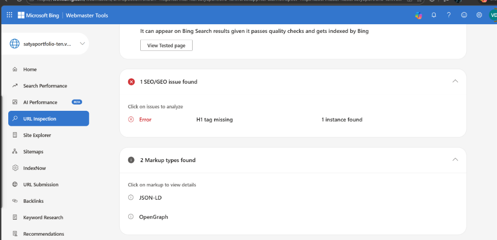

<div align="center">
  
  
  # Duba Venkata Satyanarayana | Systems Engineer

  **Engineering Scalable Systems Across Backend, Full Stack & Data**

  [](https://github.com/Satya136-dvsn/satya-spark-portfolio/actions/workflows/deploy.yml)
  [](https://satyaportfolio-ten.vercel.app/)
  [](https://opensource.org/licenses/MIT)

  [**View Live Production Deployment**](https://satyaportfolio-ten.vercel.app/)
</div>

---

## 🚀 Executive Summary

This repository houses the source code for my professional command-center portfolio. It is designed not just as a showcase of work, but as a live demonstration of **systems engineering quality**, **aesthetic control**, and **technical architecture**.

Engineered with a strict "Tron-inspired" design system (Dark `#0A0F1C` backgrounds, Cyan `#00E5FF` dominant glows, and precise Red `#FF2D55` structural accents), it immediately positions the user interface as a high-authority backend engineering portal.

**Target Audience**: Technical Recruiters, Engineering Leaders, and Collaborators looking for validatable proof of backend clarity, full-stack readiness, and architectural decision-making.

---

## 🏗 System Architecture

The application is built on a heavily optimized **Client-Side Rendering (CSR)** architecture powered by React 18 and Vite.

- **Component Design**: Atomic design principles using `shadcn/ui` (Radix Primitives) for accessible, unstyled core components reshaped via Tailwind CSS.
- **State Management**: React Context for lightweight global UI states and modal dialog triggers.
- **Micro-Interactions**: Custom CSS grid backgrounds, synchronized hardware-accelerated pulses, and strict laser-line keyframes (`translateZ(0)`) bypassing heavy JS physics engines for a locked 60fps experience.
- **Execution Deferral**: Mobile CPU blocking is drastically reduced by deferring all below-the-fold component rendering (using `React.lazy()` and `setTimeout` cascades), securing a 95+ Lighthouse Performance Score.
- **Automated Indexing**: Fully integrated with Bing's `IndexNow` API protocol with dynamic XML sitemaps and strict 130-char SEO metadata configurations.

---

## 🗺️ Portfolio Structure

The portfolio UI sequence is logically formatted to highlight engineering depth and lifecycle progression:

1. **Boot Sequence**: Automated 2.5s "Command Center Mount" leveraging React state and timeout cascades.
2. **Hero Section**: High-impact positioning as a Systems Engineer with Immediate Availability telemetry.
3. **Engineering Domains**: Core competencies isolated: Backend Systems, Full Stack Apps, Data & Analytics.
4. **System Architecture**: CSS-grid visual flow mapping `Client → API Layer → Logic → DB → Cloud`.
5. **Projects List**: Deep-dive interactive UI rendering GitHub repository details, ZK architectures, and impact metrics.
6. **Experience & Education**: High-signal vertical progression verifying professional standing.
7. **Data Intelligence**: Visual data pipeline diagram (`Raw Data → Clean Insight`).
8. **Engineering Philosophy**: Core tenets driving my deployment processes (Correctness First, Scalable Design).
9. **Tech Arsenal**: Structured, categorized stack matrix.
10. **Credentials**: Verified IEEE Publications and Azure/MS Certifications linked to Credly proofs.

---

## 💻 Tech Stack

### Core
- **Framework**: React 18
- **Language**: TypeScript 5.x (Strict Mode)
- **Build Engine**: Vite 5.x

### UI & Styling
- **Styling Engine**: Tailwind CSS 3.4
- **Component Primitives**: Radix UI / Shadcn
- **Icons**: Lucide React
- **Animations**: CSS3 Hardware Acceleration (`will-change: transform`).

### Reliability & Quality
- **Performance**: Vercel Speed Insights Integration
- **Analytics**: Google Analytics 4 (GA4)
- **Validation**: Strict SEO Metatags & Bing Fallback DOM rendering.

---

## 🛠 Getting Started

### Prerequisites
- Node.js >= 18.0.0
- npm >= 9.0.0

### Installation

1. **Clone the repository**
    ```bash
    git clone https://github.com/Satya136-dvsn/satya-spark-portfolio.git
    cd satya-spark-portfolio
    ```

2. **Install dependencies**
    ```bash
    npm ci
    ```
    *(Note: usage of `npm ci` ensures exact version matching from `package-lock.json`)*

3. **Start Development Server**
    ```bash
    npm run dev
    ```
    Access the application at `http://localhost:8080`

### Production Build
```bash
npm run build
npm run preview
```

---

## 🚀 Deployment

Configured for seamless global edge deployment on **Vercel**.

1. Connect GitHub Repository to Vercel.
2. Framework preset `Vite` is automatically detected.
3. **Push to main** triggers an automated CI/CD build, type-check, and global deployment.

---

### 📬 Contact

**Duba Venkata Satyanarayana**

- **Email**: [d.v.satyanarayana260@gmail.com](mailto:d.v.satyanarayana260@gmail.com)
- **LinkedIn**: [View Professional Profile](https://www.linkedin.com/in/venkatasatyanarayana-duba-679372255)
- **GitHub Registry**: [Satya136-dvsn](https://github.com/Satya136-dvsn)
- **Live System**: [satyaportfolio-ten.vercel.app](https://satyaportfolio-ten.vercel.app/)

---
<div align="center">
  <i>© 2026 Duba Venkata Satyanarayana. Engineered with precision.</i>
</div>
